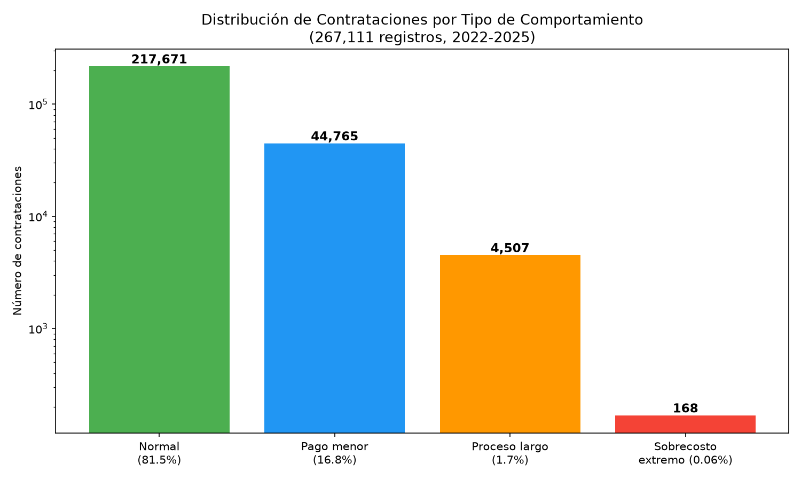

# Detección de Anomalías en Contrataciones Públicas del Perú

Proyecto de ciencia de datos aplicado a la identificación de patrones anómalos en contrataciones públicas registradas en el sistema CONOSCE/OSCE, mediante técnicas de clustering no supervisado.

## Descripción

Este proyecto analiza más de **267,000 registros** de adjudicaciones de contrataciones públicas en Perú (2022-2025), con el objetivo de identificar contrataciones cuyo comportamiento se desvía significativamente de lo esperado, ya sea por diferencias extremas entre el monto presupuestado y el monto pagado, o por duraciones de proceso atípicas.

El enfoque no busca afirmar la existencia de fraude o irregularidades, sino **reducir el universo de revisión** para un auditor o perito, señalando los casos estadísticamente más atípicos para su evaluación posterior.

## Objetivo

Aplicar algoritmos de clustering (K-means, clustering jerárquico) sobre datos abiertos de contrataciones públicas para:

- Identificar grupos de contrataciones con comportamiento similar
- Aislar contrataciones con comportamiento anómalo (sobrecostos extremos, procesos atípicamente largos o cortos)
- Generar una lista priorizada de casos para revisión manual

## Fuente de datos

Datos abiertos del **Portal de Datos Abiertos del OECE (antes OSCE)**, sistema CONOSCE, correspondientes a adjudicaciones del Sistema Electrónico de Contrataciones del Estado (SEACE), periodo 2022-2025.

> Los archivos originales (.xlsx) no se incluyen en este repositorio por su tamaño. Pueden descargarse desde el portal oficial: https://www.gob.pe/14272-acceder-al-portal-de-datos-abiertos-del-oece

Para reproducir este proyecto, descargar los archivos de "Datos de la Adjudicación" para los años 2022-2025 y colocarlos en `data/raw/` con los nombres:

```
CONOSCE_ADJUDICACIONES2022_0.xlsx
CONOSCE_ADJUDICACIONES2023_0.xlsx
CONOSCE_ADJUDICACIONES2024_0.xlsx
CONOSCE_ADJUDICACIONES2025_0.xlsx
```

## Metodología

### 1. Carga y unificación de datos
Se cargaron y concatenaron los 4 archivos anuales, obteniendo un dataset de 267,772 registros y 25 columnas.

### 2. Limpieza de datos
Se eliminaron registros con valores nulos en columnas críticas (montos, fechas, tipo de proveedor), resultando en 267,698 registros.

### 3. Feature engineering
Se crearon las siguientes variables:

- **diferencia_monto**: diferencia entre el monto adjudicado y el monto referencial (en soles)
- **diferencia_pct**: diferencia porcentual entre ambos montos
- **diferencia_pct_cap**: versión de la anterior, acotada entre -100% y 500% para controlar valores extremos
- **dias_proceso**: días transcurridos entre la fecha de convocatoria y la fecha de buena pro

Se identificaron y separaron 587 registros con monto referencial igual a cero, tratados como un grupo especial de posibles errores de registro.

### 4. Tratamiento de outliers
La variable `diferencia_pct` presentaba valores extremos (hasta el orden de 10^10%) debido a montos referenciales casi nulos. Se aplicó un acotamiento (capping) entre -100% y 500%, afectando solo el 0.02% de los registros.

### 5. Escalado
Las variables numéricas se escalaron con `StandardScaler` para que tuvieran media 0 y desviación estándar 1, condición necesaria para que el clustering no esté dominado por variables de mayor magnitud (como los montos en soles).

### 6. Clustering jerárquico (exploratorio)
Sobre una muestra de 2,000 registros, se generó un dendrograma con linkage de Ward para explorar visualmente la estructura de los datos y orientar la elección del número de clusters.

### 7. Selección de variables: monto vs. comportamiento
Un primer modelo K-means (k=4) utilizando variables de monto fue dominado por la magnitud de los contratos, agrupando principalmente por tamaño y no por comportamiento anómalo.

Se optó por un segundo modelo enfocado en variables de **comportamiento**, independientes del tamaño del contrato:

- `diferencia_pct_cap`
- `dias_proceso`

### 8. Determinación del número de clusters
Se aplicó el método del codo sobre las variables de comportamiento, evaluando k entre 1 y 10. Se identificó un codo entre k=4 y k=5, seleccionando **k=4**.

### 9. Clustering final (K-means, k=4)
Se aplicó K-means sobre las 267,111 contrataciones con monto referencial distinto de cero.

## Resultados

El modelo identificó 4 grupos de comportamiento:

| Cluster | Registros | % | diferencia_pct_cap (media) | dias_proceso (media) | Interpretación |
|---|---|---|---|---|---|
| 0 | 217,671 | 81.5% | -2.4% | 24.5 | Comportamiento normal |
| 1 | 44,765 | 16.8% | -33.5% | 37.8 | Pago significativamente menor al presupuestado |
| 2 | 4,587 | 1.7% | -26.0% | 330.4 | Procesos de duración atípicamente larga |
| 3 | 168 | 0.06% | +369.8% | 51.3 | Sobrecosto extremo |

### Casos prioritarios (Cluster 3)

De los 168 registros del Cluster 3, se identificaron **78 casos** con monto referencial superior a 1,000 soles (excluyendo posibles errores de registro con montos referenciales casi nulos), exportados en `results/casos_sospechosos.csv`.

Estos casos presentan sobrecostos de entre 5 y 17 veces el monto presupuestado, en entidades como PETROPERÚ S.A., universidades nacionales y gobiernos regionales.

# Comparación con DBSCAN

Como complemento al modelo K-means, se aplicó **DBSCAN** (Density-Based Spatial Clustering of Applications with Noise), un algoritmo basado en conectividad por densidad que identifica automáticamente los puntos que no pertenecen a ninguna región densa, clasificándolos como "ruido".

### Consideraciones de escalabilidad

DBSCAN requiere calcular distancias entre todos los pares de puntos, lo que resultó en un error de memoria al aplicarlo sobre el dataset completo (267,111 registros). Por esta razón, se aplicó sobre una **muestra aleatoria de 10,000 registros** (semilla fija para reproducibilidad), siguiendo la misma estrategia utilizada para el dendrograma jerárquico.

### Resultados (muestra de 10,000 registros)

| Cluster DBSCAN | Registros | diferencia_pct_cap (media) | dias_proceso (media) | Interpretación |
|---|---|---|---|---|
| 0 | 9,844 | +7.7% | 28.4 | Comportamiento normal (zona densa) |
| -1 (ruido) | 129 | +19.4% | 269.8 | Procesos de duración atípicamente larga |
| 1 | 27 | -97.0% | 548.8 | Procesos extremadamente largos con pago muy por debajo de lo presupuestado |

### K-means vs. DBSCAN: hallazgos complementarios

Ambos algoritmos identifican anomalías, pero con sensibilidades distintas:

- **K-means (k=4)** fue más sensible a anomalías de **magnitud**, destacando un grupo de 168 contrataciones (0.06%) con sobrecostos extremos (+369.8% en promedio).
- **DBSCAN** fue más sensible a anomalías de **densidad/tiempo**, destacando grupos de contrataciones con duraciones de proceso muy por encima de lo habitual (270 a 548 días frente a un promedio general de ~32 días), independientemente de si el monto se desvió mucho del presupuesto.

Esto sugiere que ambos enfoques son complementarios: K-means resulta útil para priorizar casos por **sobrecosto**, mientras que DBSCAN resulta útil para priorizar casos por **duración anómala del proceso**, una dimensión que el primer modelo no destacaba con la misma claridad.

## Análisis adicional: Contrataciones Directas
 
Como extensión del análisis, se incorporó el dataset de **Contrataciones Directas** (procesos adjudicados sin concurso competitivo, bajo causales como situación de emergencia, proveedor único o desabastecimiento inminente), con el objetivo de evaluar si los casos de sobrecosto extremo (Cluster 3) estaban asociados a este tipo de procesos.
 
### Metodología
 
Se unificaron los archivos de Contrataciones Directas (2022-2025), totalizando 20,928 registros. Mediante la columna `codigoconvocatoria`, se creó una variable binaria `es_contratacion_directa` en el dataset principal, identificando 20,575 registros (7.7% del total) correspondientes a este tipo de proceso.
 
Las causales más frecuentes de contratación directa fueron:
 
- Situación de emergencia: 34.5%
- Proveedor único: 19.9%
- Desabastecimiento inminente: 16.9%
- Arrendamiento o adquisición de bienes inmuebles existentes: 16.5%
### Hipótesis evaluada
 
Se planteó la hipótesis de que las contrataciones directas, al no pasar por un proceso competitivo, estarían sobrerrepresentadas en el Cluster 3 (sobrecosto extremo).
 
### Resultado
 
| Cluster | % Contrataciones Directas |
|---|---|
| 0 (Normal) | 9.31% |
| 1 (Pago menor al presupuestado) | 0.65% |
| 2 (Procesos largos) | 0.31% |
| 3 (Sobrecosto extremo) | 1.79% |
 
**La hipótesis no se confirmó.** El Cluster 0 (comportamiento normal) presenta la mayor proporción de contrataciones directas (9.31%), mientras que el Cluster 3 (sobrecosto extremo) presenta una proporción menor (1.79%).
 
### Interpretación
 
Una posible explicación es que las contrataciones directas, especialmente aquellas justificadas por proveedor único o emergencia, suelen tener montos pactados desde el inicio del proceso, con poco margen de variación posterior entre lo referencial y lo adjudicado. En contraste, los sobrecostos extremos detectados parecen estar más asociados a procesos competitivos (licitaciones, adjudicaciones simplificadas), donde el monto referencial podría haberse calculado de forma incorrecta o haber sido modificado significativamente durante el proceso.
 
Este resultado no descarta que existan irregularidades en las contrataciones directas; sugiere que, de existir, estas no se manifiestan principalmente como desviaciones extremas entre el monto referencial y el monto adjudicado, sino que requerirían otras variables (por ejemplo, recurrencia de proveedores, tiempos de aprobación) para ser detectadas.


## Análisis adicional: Concentración de proveedores
 
Se analizó la distribución de adjudicaciones por proveedor (`ruc_proveedor`), con el objetivo de identificar posibles patrones de concentración del mercado de contratación pública.
 
### Distribución general
 
Sobre 104,551 proveedores distintos que participaron entre 2022 y 2025:
 
| Estadístico | Valor |
|---|---|
| Promedio de ítems ganados por proveedor | 2.55 |
| Mediana (percentil 50) | 1 |
| Percentil 75 | 1 |
| Máximo | 2,191 |
 
El 75% de los proveedores ganó un único ítem en el periodo analizado, mientras que el proveedor con mayor participación ganó 2,191 ítems, una concentración considerablemente mayor al promedio.
 
### Caso de mayor concentración
 
El proveedor con más adjudicaciones fue **Grupo Santa Fe S.A.C.** (RUC 20511037001), con las siguientes características:
 
- 2,191 ítems adjudicados
- 295 entidades públicas distintas como clientes
- Monto total adjudicado: S/. 439,933,852.92
- Monto promedio por ítem: S/. 200,791.35
- 100% de sus adjudicaciones corresponden a la categoría "Bien" (ningún servicio ni obra)
### Interpretación
 
Si bien el volumen de adjudicaciones de este proveedor es considerablemente mayor al promedio, las características del caso (diversificación entre 295 entidades distintas, montos por ítem de magnitud media, y especialización en una sola categoría de objeto contractual) son consistentes con el perfil de un proveedor establecido a nivel nacional en el suministro de bienes, más que con un patrón de favoritismo hacia una entidad específica.
 
Este análisis ilustra la importancia de complementar los indicadores de concentración con variables de contexto (diversificación de clientes, tipo de objeto contractual) antes de calificar un patrón como anómalo.


## Visualizaciones

El notebook incluye:

- Dendrograma jerárquico (muestra de 2,000 registros)
- Gráfico de dispersión: clusters por monto referencial vs. diferencia porcentual
- Gráfico de dispersión: clusters de comportamiento (días de proceso vs. diferencia porcentual)



## Tecnologías utilizadas

- Python 3.11
- pandas, numpy
- scikit-learn (KMeans, StandardScaler)
- scipy (clustering jerárquico)
- matplotlib, seaborn
- Jupyter Notebook

## Estructura del repositorio

```
deteccion-anomalias-contrataciones/
├── data/
│   ├── raw/              # Archivos originales (no incluidos, ver instrucciones de descarga)
│   └── processed/
├── notebooks/
│   ├── 01_exploracion.ipynb   # Análisis exploratorio completo, paso a paso
│   └── 02_pipeline.ipynb      # Pipeline limpio y reproducible usando los módulos de src/
├── src/
│   ├── data_loader.py     # Carga y unificación de los datasets anuales
│   ├── preprocessing.py   # Limpieza de datos y feature engineering
│   └── clustering.py      # Funciones de clustering (K-means y DBSCAN)
├── results/
│   └── casos_sospechosos.csv
├── requirements.txt
└── README.md
```
### Sobre los dos notebooks
 
- **`01_exploracion.ipynb`**: contiene el proceso completo de análisis exploratorio, incluyendo la justificación de cada decisión (tratamiento de outliers, elección de variables, comparación de modelos). Es el notebook recomendado para entender el razonamiento detrás del proyecto.
- **`02_pipeline.ipynb`**: una vez validado el enfoque en el notebook exploratorio, la lógica se modularizó en funciones reutilizables dentro de `src/`. Este notebook ejecuta el pipeline completo (carga → limpieza → clustering → visualización) en pocas líneas, facilitando su reproducción o integración en otros flujos de trabajo.
  
### Sobre los módulos de `src/`
 
| Módulo | Función principal | Descripción |
|---|---|---|
| `data_loader.py` | `cargar_adjudicaciones()` | Carga los 4 archivos anuales de adjudicaciones y los unifica en un solo DataFrame |
| `preprocessing.py` | `limpiar_y_preparar()` | Elimina nulos en columnas críticas, separa casos con monto referencial igual a cero, y crea las variables `diferencia_monto`, `diferencia_pct`, `diferencia_pct_cap` y `dias_proceso` |
| `clustering.py` | `aplicar_kmeans()`, `aplicar_dbscan_muestra()` | Escala las variables y aplica K-means sobre el dataset completo; aplica DBSCAN sobre una muestra aleatoria por limitaciones de memoria |
 
Esta separación permite que el pipeline sea fácilmente extensible: por ejemplo, incorporar un nuevo dataset solo requiere agregar una función en `data_loader.py`, sin modificar la lógica de limpieza o clustering.
 

## Cómo reproducir el proyecto

```bash
# Clonar el repositorio
git clone https://github.com/maadelim/deteccion-anomalias-contrataciones.git
cd deteccion-anomalias-contrataciones

# Crear y activar entorno virtual
python -m venv venv
venv\Scripts\activate        # Windows
source venv/bin/activate     # Mac/Linux

# Instalar dependencias
pip install -r requirements.txt

# Colocar los archivos de datos en data/raw/ (ver sección "Fuente de datos")

# Ejecutar el notebook
jupyter notebook notebooks/01_exploracion.ipynb
```

## Limitaciones y consideraciones

- El clustering identifica desviaciones estadísticas, no determina por sí mismo la existencia de irregularidades; los resultados requieren validación por un experto en la materia (peritaje contable).
- Algunos registros con montos referenciales extremadamente bajos (cercanos a cero) generan porcentajes de diferencia poco interpretables y deben tratarse como un grupo separado de posible error de registro, no como anomalías de comportamiento.
- El periodo analizado (2022-2025) no incluye el contexto de contrataciones de emergencia sanitaria (2020-2021), que tienen reglas y patrones distintos.

## Próximos pasos

- Incorporar el dataset de Proveedores y Consorcios para evaluar la concentración de adjudicaciones por proveedor.
- Aplicar clustering jerárquico y DBSCAN sobre el conjunto completo de variables de comportamiento, incluyendo `es_contratacion_directa`, para comparar resultados con K-means.
- Incorporar variables categóricas adicionales (tipo de entidad, tipo de proceso de selección) mediante codificación.


## Conclusiones generales
 
Este proyecto aplicó técnicas de clustering no supervisado (K-means, clustering jerárquico y DBSCAN) sobre 267,111 registros de adjudicaciones públicas en Perú (2022-2025), con el objetivo de identificar contrataciones cuyo comportamiento se desvía significativamente del resto.
 
### Principales hallazgos
 
1. **El comportamiento normal domina el dataset.** El 81.5% de las contrataciones presentan diferencias pequeñas entre el monto presupuestado y el pagado, y tiempos de proceso cercanos al promedio (~25 días).
2. **Existen patrones de anomalía claramente distinguibles y de distinta naturaleza:**
   - Un grupo de 168 contrataciones (0.06%) con sobrecostos extremos (en promedio, +369.8% sobre lo presupuestado), detectado mediante K-means.
   - Un grupo adicional, detectado mediante DBSCAN, de contrataciones con duraciones de proceso atípicamente largas (270 a 548 días frente a un promedio de 32 días).
   - Estos dos tipos de anomalía (de magnitud y de tiempo) no necesariamente coinciden en los mismos registros, lo que sugiere que corresponden a fenómenos distintos.
3. **Las hipótesis exploradas no siempre se confirmaron, y eso es informativo.** Se esperaba que las contrataciones directas estuvieran sobrerrepresentadas en el grupo de sobrecosto extremo; los datos mostraron lo contrario (1.79% vs. 9.31% en el grupo normal), sugiriendo que el fenómeno de sobrecosto extremo está más asociado a procesos competitivos.
4. **La concentración de proveedores es alta pero no necesariamente irregular.** Si bien el 75% de los proveedores ganó un solo ítem en 4 años y el proveedor líder ganó 2,191, el análisis de contexto (diversificación entre 295 entidades, montos medios, especialización en una categoría) es consistente con un proveedor de gran escala más que con un patrón de favoritismo puntual.
### Valor del enfoque
 
El clustering no determina por sí mismo la existencia de irregularidades, pero permite **reducir el universo de revisión** de 267,111 registros a un conjunto acotado y priorizado (78 casos de sobrecosto extremo verificados, más los grupos identificados por DBSCAN), sobre el cual un perito contable podría enfocar su análisis.
 
### Aprendizajes técnicos del proyecto
 
- La elección de variables determina qué tipo de anomalía detecta el modelo: un primer intento con variables de monto fue dominado por el tamaño del contrato; el cambio a variables de comportamiento (diferencia porcentual y duración) permitió detectar anomalías independientes de la escala.
- Algoritmos distintos (K-means y DBSCAN) son sensibles a distintos tipos de anomalía, por lo que su uso combinado ofrece una visión más completa que el uso de uno solo.
- DBSCAN, al requerir el cálculo de distancias entre todos los pares de puntos, no escala a datasets de cientos de miles de registros sin técnicas de muestreo.
- Validar hipótesis con datos adicionales (contrataciones directas, concentración de proveedores) es tan valioso cuando refuta una hipótesis inicial como cuando la confirma.
 

## Autora

Made Mallma Moreno
